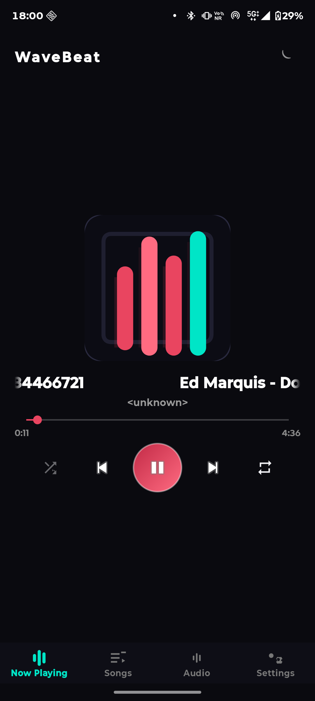
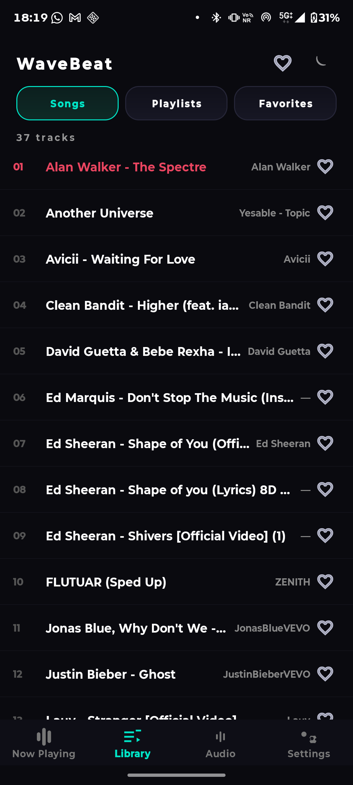
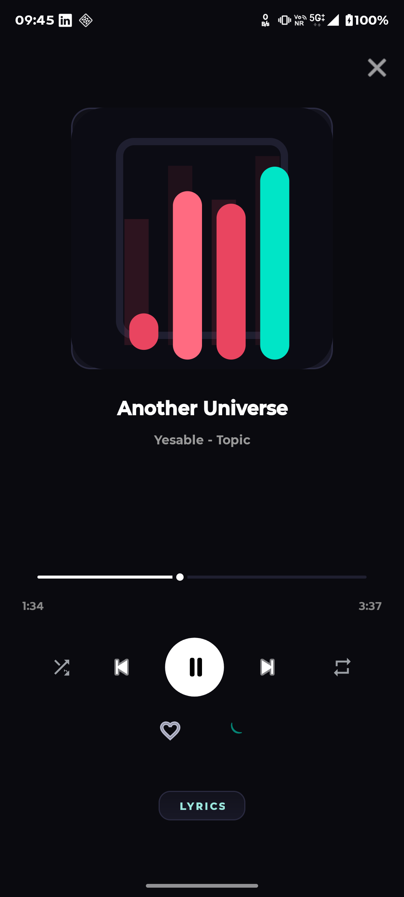
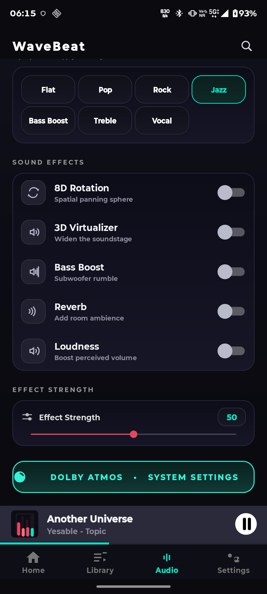
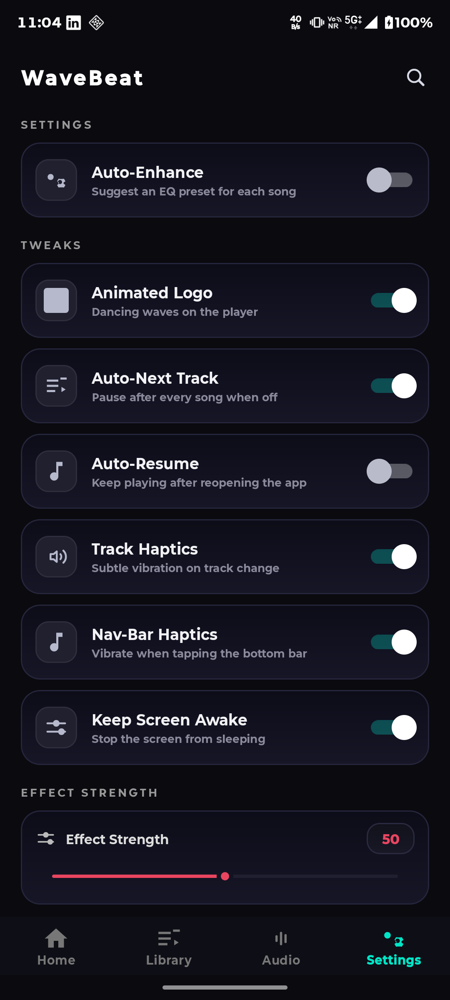
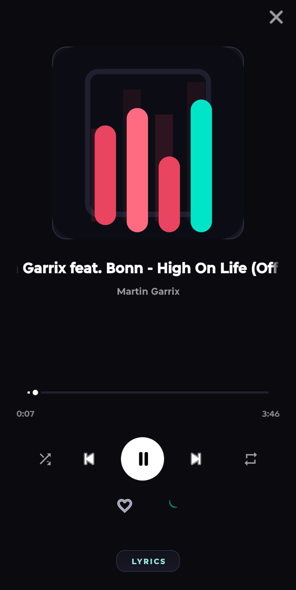
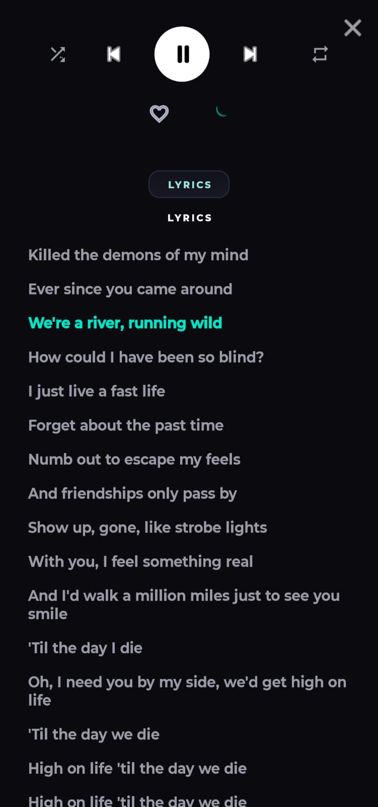

# WaveBeat

A lightweight, offline-first Android music player built with Kotlin and Media3 (ExoPlayer). Beautiful dark UI with haptics, Equalizer, playlists, favorites, and a fully custom player overlay.

## Screenshots

| Home | Songs | Player overlay | Audio | Settings |
|:---:|:---:|:---:|:---:|:---:|
|  |  |  |  |  |

**Synced lyrics:**

<div align="center">
  
  
</div>

## Features

- **Player overlay** — shuffle, prev/next, play/pause, repeat (off / one / all), tap + swipe seek bar
- **Mini player** — title, artist, progress bar, one tap opens the full overlay
- **Library** — full songs list (cached for fast cold start), search filters live
- **Playlists** — create, rename, delete, add songs from a multi-select dialog
- **Favorites** — persist and render across restarts
- **Audio** — equalizer intensity slider, audio presets, bass boost / reverb / loudness, launch into system Dolby / Music Center
- **Auto-pause** — respects audio focus (pauses on interruptions)
- **Auto-next / auto-resume** — configurable from Settings
- **Sleep timer** — dialog-based, per session
- **Lyrics panel** — per track
- **Tweaks** — track haptics, nav-bar haptics, keep-screen-on, animated dance logo, splash screen

Full details in [FEATURES.md](FEATURES.md).

## Requirements

- Android 8.0+ (API 26+)
- Storage access to audio files (MediaStore audio permission)

## Download

Grab the latest APK from the [Releases](https://github.com/rmounikkumar/wavebeat-with-lyrics/releases) page and install it on your device.

> The APK is signed with the debug key, intended for personal/testing installs.

## Changelog

- **v1.0.8** — Fixed songs whose downloaded title *contains the artist and feat. text* (e.g. "My Stupid Heart (Ft. LAUV) - Walk off the Earth [Official Lyric Video]"): the strict search came back empty, so no lyrics appeared even though LRCLIB has the real synced track. The app now retries with a relaxed query (first " - " segment, parentheses stripped) when the first search returns nothing — "My Stupid Heart" now loads its **synced** lyrics (LRCLIB track 21191415).
- **v1.0.7** — Online Lyrics ON now also shows *plain* lyrics when LRCLIB has no timed version of a song (e.g. "Another Universe" by Yesable, which LRCLIB only stores as untimed text). Synced lyrics are still preferred whenever they exist; local `.lrc` files and embedded lyrics still come first; turning the toggle OFF still means offline-only. Also fixed: songs whose artist is a YouTube auto channel ("Artist - Topic") used to return no lyrics because the word "Topic" made the LRCLIB search come back empty — that word is now stripped from the artist when searching.
- **v1.0.6** — New: **Settings → Online Lyrics** toggle. When ON (default), songs without a local `.lrc` file or embedded lyrics get synced lyrics auto-fetched from LRCLIB, exactly as in v1.0.4. When OFF, the app only shows offline lyrics (your `.lrc` files and embedded lyrics) — nothing is fetched from the web. Also: online results that LRCLIB marks as "synced" but that contain no actual timestamps are now rejected instead of being shown as unsynchronized text.
- **v1.0.5** — Fix: app no longer crashes on startup / whenever a song is tapped if the media session's queue is momentarily empty (for example right after a new download is scanned in or a song is deleted). The queue re-sync gracefully treats the missing state as "nothing playing yet" instead of throwing an index-out-of-bounds crash and getting stuck in a restart loop.
- **v1.0.4** — New: songs with no `.lrc` file and no embedded lyrics now get synchronized lyrics automatically, fetched from the public LRCLIB API (offline safety: if there's no connection or no match, the app simply shows "No lyrics found in this track" exactly as before). Local `.lrc` files and embedded-lyrics lookup still take priority — online fetching is only the last fallback, so nothing about existing behavior changes.
- **v1.0.3** — Fix: playing a freshly downloaded MP3 no longer starts a different song. The player queue now stays in sync with the library — when new audio is scanned in (or the library changes), the queue is rebuilt to mirror the song list exactly (preserving the currently playing track), so tapping any song in the library (or the All songs list) plays exactly that song, and next/prev follow library order everywhere — including from the notification and Bluetooth controls.
- **v1.0.2** — Fix: the media notification / shade card no longer disappears when you pause playback (paused with Bluetooth connected, the card now stays put and play resumes it smoothly). The service stays a foreground media service while a playlist is loaded, so the controls remain visible in the notification shade whether playing or paused.
- **v1.0.1** — Fix: 8D / 3D / Bass / Reverb / Loudness effect settings now persist across restarts (previously they silently reset to OFF every launch). Rotational 8D pan and widened 3D soundstage verified with stereo output.
- **v1.0.0** — Synced `.lrc` lyrics with a junk-safe sidecar picker, embedded fallback, plus the full player experience.

## Build

```bash
./gradlew assembleDebug
```

APK output: `app/build/outputs/apk/debug/app-debug.apk`

Install on a connected device:

```bash
adb install -r app/build/outputs/apk/debug/app-debug.apk
```

## Tech Stack

- Kotlin
- AndroidX (core-ktx, appcompat, material)
- Media3 ExoPlayer + media3-session
- Custom views & drawables for the equalizer, mini player, and animated logo

## Project Structure

```
app/src/main/java/com/wavebeat/
├── MainActivity.kt       # Main UI: tabs, library, player overlay, settings
├── MusicService.kt       # Media3 service: playback, equalizer, auto-next/resume
├── SongListActivity.kt   # Song listing screen
├── SplashActivity.kt     # Splash + animated logo
└── DancingLogoDrawable.kt# Dancing logo animation
```

## License

Released under the [MIT License](LICENSE).